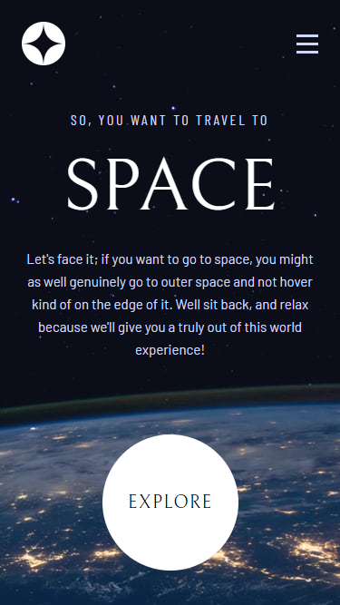
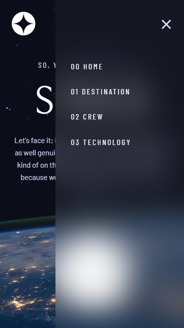
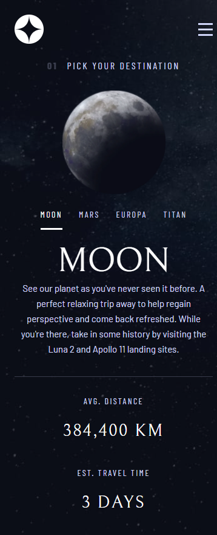
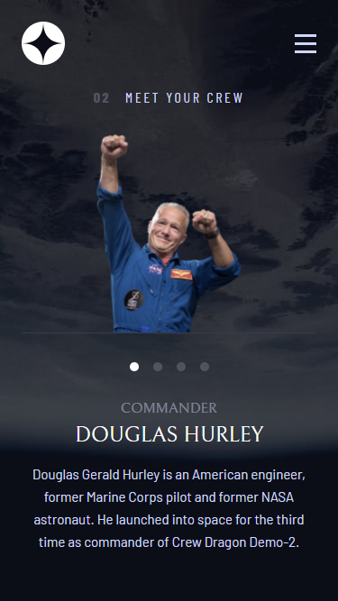
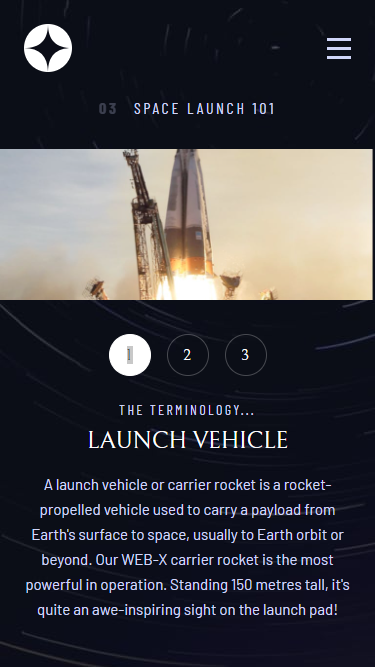
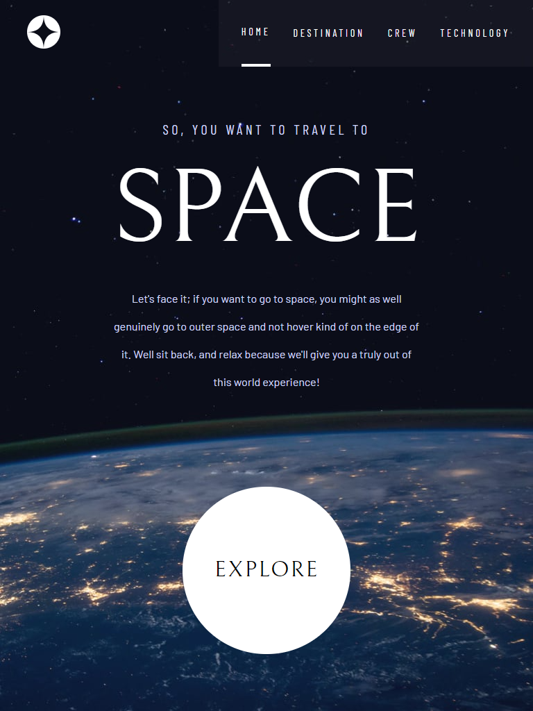

# Frontend Mentor - Space tourism website solution

This is a solution to the [Space tourism website challenge on Frontend Mentor](https://www.frontendmentor.io/challenges/space-tourism-multipage-website-gRWj1URZ3). Frontend Mentor challenges help you improve your coding skills by building realistic projects.

## Table of contents

- [Overview](#overview)
  - [The challenge](#the-challenge)
  - [Screenshots](#screenshots)
  - [Links](#links)
- [My process](#my-process)
  - [Built with](#built-with)
  - [What I learned](#what-i-learned)
  - [Continued development](#continued-development)
  <!-- - [Useful resources](#useful-resources) -->
- [Author](#author)

## Overview

### The challenge

Users should be able to:

- View the optimal layout for each of the website's pages depending on their device's screen size
- See hover states for all interactive elements on the page
- View each page and be able to toggle between the tabs to see new information

### Screenshots

> Mobile Previews

> Tablet Previews

### Links

- Solution URL: [Add solution URL here](https://your-solution-url.com)
<!-- - Live Site URL: [Add live site URL here](https://your-live-site-url.com) -->

## My process

### Built with

- Semantic HTML5 markup
- CSS custom properties
- Media Queries
- Flexbox
- Fetch API
- Mobile-first workflow
- [React](https://reactjs.org/) - JS library
- [Sass](https://sass-lang.com/) - CSS preprocessor
- [Vite.js](https://vitejs.dev/) - Bundler JS

### What I learned

To build this project I had to use everything that I know and a lot more because it wasn't enough. I learned a lot of things that I didn't know and every time that I've tried to change something or to make it better I had to search and learn something different. It was very challenging but I still think that there are a lot of room for improvement. I spent a lot of time searching for answers and ways to better translate what I was thinking to code and was able to build something acceptable. I still continue to change every little detail that I think could be better executed. The variety of layouts for different screen sizes made me understand so many things about css. It's so rich of functionalities, and I know that there's so much to learn yet.
I made a mistake about the use of classes and had my first conflict with css across my components. That made me realize things that I had heard or read before, but didn't really comprehend.'

### Continued development

I need to keep working with the different hooks on react to fully understand them. And something for my next project is that I want to use styled components just to see the usefulness.

<!--
### Useful resources

- [Example resource 1](https://www.example.com) - This helped me for XYZ reason. I really liked this pattern and will use it going forward.
- [Example resource 2](https://www.example.com) - This is an amazing article which helped me finally understand XYZ. I'd recommend it to anyone still learning this concept. -->

## Author

- Github - [William Firmino](https://github.com/Willwf)
- Frontend Mentor - [@Willwf](https://www.frontendmentor.io/profile/Willwf)
- Twitter - [@Williamwf](https://www.twitter.com/Williamwf)
- LinkedIn - [William Firmino](https://www.linkedin.com/in/williamfirmino/)
